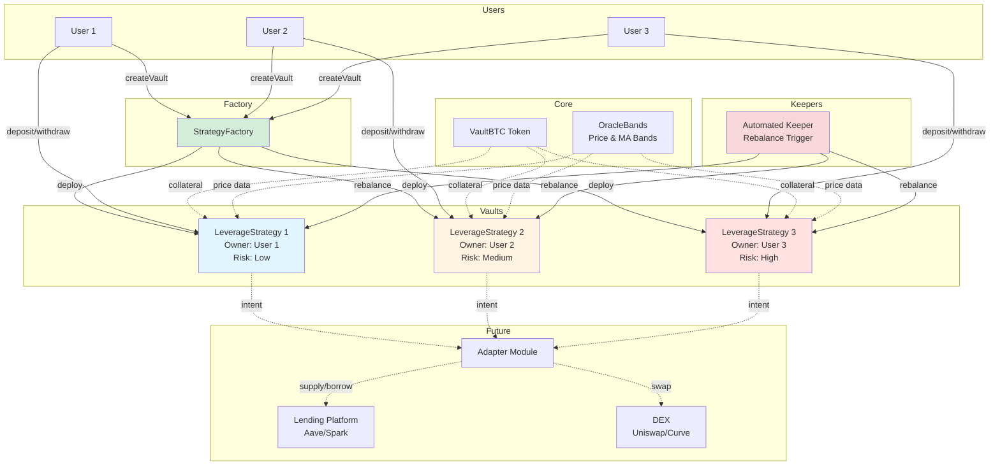
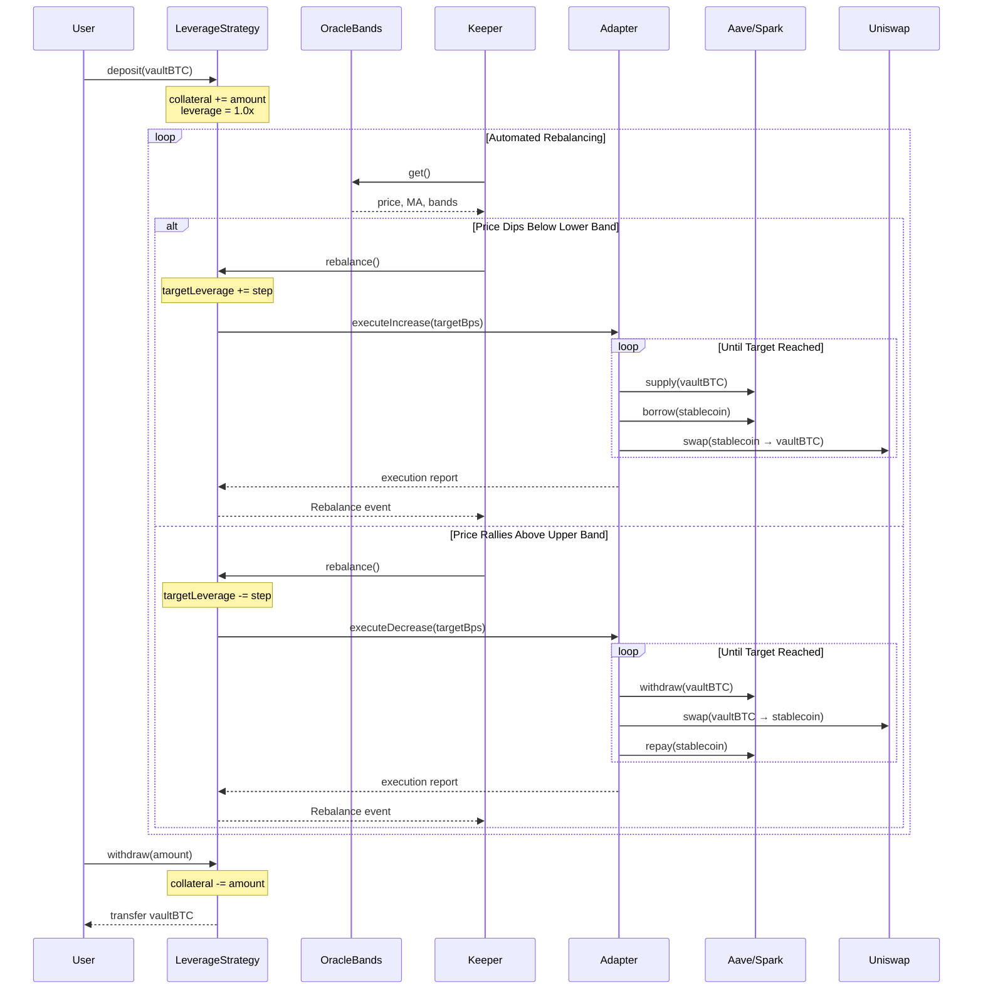
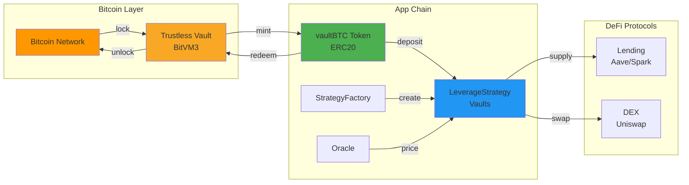

# Architecture Diagram

## System Flow

## Leverage Loop (Production)

## Bitcoin Trustless Vault Integration

## Key Concepts

### Factory Pattern
- Users call `StrategyFactory.createVault(riskTier)` to deploy their own isolated vault
- Each vault is owned by the creator
- Factory maintains registry for discovery

### Access Control
- **Owner-only**: deposit, withdraw, setRisk
- **Public**: rebalance (automated by keepers)

### Intent-Based Execution
- Strategy sets target leverage (intent)
- Adapter executes on lending/DEX (execution)
- Separation allows upgradeable execution logic

### Self-Custody
- Users maintain full control over their vaultBTC
- Only owner can withdraw funds
- System can only optimize leverage, not extract funds
