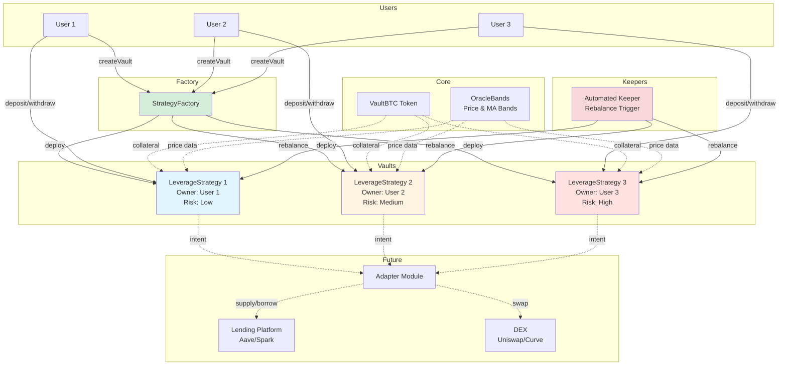
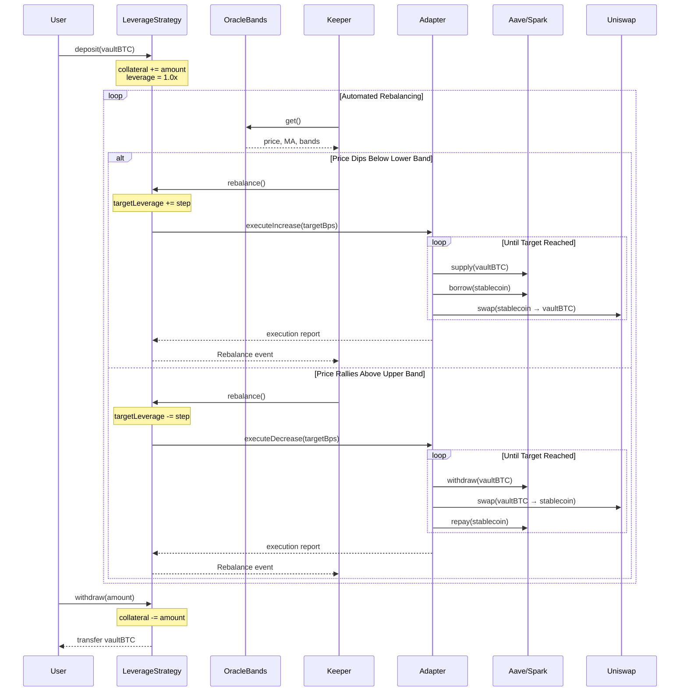
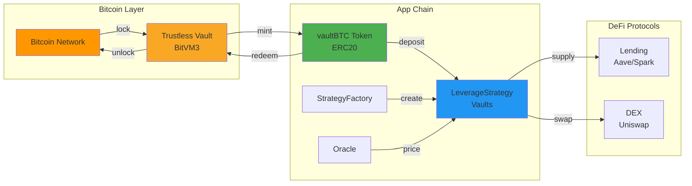

# Architecture & Design

## System Overview

The vaultBTC Auto-Leverage Strategy uses a factory pattern where each user deploys their own isolated vault contract. The system automatically adjusts leverage based on price movements relative to MA bands, while maintaining user custody of funds.

## Factory Pattern

Users create isolated vaults via `StrategyFactory.createVault(riskTier)`:
- Each user gets their own `LeverageStrategy` contract
- Factory maintains registry of all vaults
- Vault ownership is set to the creator (`msg.sender`)
- Factory tracks vaults by owner for easy discovery

## Contract Architecture

### StrategyFactory.sol
- Creates isolated LeverageStrategy vaults for each user
- Tracks all deployed vaults in registry
- Provides vault lookup by user address
- Emits `VaultCreated` events for indexing

### LeverageStrategy.sol
- Per-user isolated vault (created by factory)
- **Owner-only**: deposit, withdraw, setRisk
- **System-callable**: rebalance (automated leverage/deleverage)
- **Risk tiers**: Low/Medium/High with different max leverage and step sizes
- **Rebalance logic**: adjusts `targetLeverageBps` based on price vs bands
- **Position tracking**: tracks collateral, debt, and current leverage

### VaultBTC.sol
- Minimal ERC20 implementation (8 decimal precision)
- Public `mint()` and `burn()` functions (demo only)
- In production: replace with real vault token from Bitcoin bridge

### OracleBands.sol
- Owner-updatable price oracle (demo)
- Stores: spot price, MA, upper band, lower band
- All values use 8 decimal precision
- In production: replace with Chainlink/TWAP oracle

## Access Control Model

### Owner-Only Functions
- `deposit()` - Add vaultBTC collateral
- `withdraw()` - Remove vaultBTC collateral
- `setRisk()` - Change risk tier (Low/Medium/High)

### Public/System Functions
- `rebalance()` - Adjust leverage based on price bands (callable by keepers/bots)

This separation allows:
- Users maintain full control over their funds
- Automated systems can optimize leverage without withdrawal risk
- Keepers can trigger rebalances for all vaults

## Rebalance Logic

### Core Algorithm

The strategy compares spot price to MA bands and adjusts target leverage:

```
if (price <= lowerBand):
    targetLeverage += stepSize  // up to maxLeverage for risk tier
    
if (price >= upperBand):
    targetLeverage -= stepSize  // down to 1.0x
```

### Risk Tier Parameters

| Risk Tier | Max Leverage | Step Size | Use Case |
|-----------|--------------|-----------|----------|
| Low | 1.1x (11000 bps) | 0.05x (500 bps) | Conservative, minimal liquidation risk |
| Medium | 1.3x (13000 bps) | 0.1x (1000 bps) | Balanced risk/reward |
| High | 1.5x (15000 bps) | 0.1x (1000 bps) | Aggressive, higher returns but more risk |

### Execution Flow

**Demo (Current)**
1. `rebalance()` called by keeper/system
2. Oracle provides: price, MA, upper band, lower band
3. Strategy calculates new `targetLeverageBps`
4. Updates synthetic `positionSize` and `debt`
5. Emits `Rebalance` event

**Production (Future)**
1. `rebalance()` called by keeper/system
2. Oracle provides: price, MA, upper band, lower band
3. Strategy calculates new `targetLeverageBps`
4. Adapter module executes the leverage change:
   - **Increase leverage**: Supply BTC → Borrow stablecoin → Swap to BTC → Repeat
   - **Decrease leverage**: Withdraw BTC → Swap to stablecoin → Repay debt → Repeat
5. Adapter reports fill data for PnL tracking
6. Emits `Rebalance` event with execution details

## Leverage Loop (Production)

### Increasing Leverage (Price Dips)
1. Supply existing vaultBTC to lending platform (Aave/Spark)
2. Borrow stablecoin (USDC/DAI) against collateral
3. Swap stablecoin → vaultBTC via DEX (Uniswap/Curve)
4. Repeat steps 1-3 until target leverage reached

### Decreasing Leverage (Price Rallies)
1. Withdraw some vaultBTC from lending platform
2. Swap vaultBTC → stablecoin via DEX
3. Repay borrowed stablecoin debt
4. Repeat until target leverage reached

### Demo Implementation
Current demo uses synthetic accounting:
- `collateral` - user's vaultBTC deposit
- `positionSize` - synthetic total position (collateral × leverage)
- `debt` - synthetic stablecoin debt
- No actual lending/DEX calls (for testing logic only)

## Intent-Based Architecture

The strategy only sets **intent** (target leverage). A separate adapter module (off-chain keeper or on-chain bot) executes on DEX/Lending venues and reports fills.

This separation allows:
- Strategy logic remains simple and auditable
- Adapters can be upgraded without touching core strategy
- Multiple execution venues can be supported
- Slippage protection and execution optimization at adapter level

### Extending to Real Protocols

Add `IAdapter.executeTargetLeverage(targetBps)`:
- Adapter computes required delta (buy/sell amounts)
- Enforces slippage bounds and rate limits
- Submits trades to lending platform and DEX
- Stores fill data for PnL accounting
- Returns execution summary to strategy

## Integration Points (Production)

### Lending Platform
- Interface: `ILendingPool` (Aave/Spark compatible)
- Functions: `supply()`, `borrow()`, `repay()`, `withdraw()`
- Health factor monitoring required

### DEX Router
- Interface: `IDEXRouter` (Uniswap V2/V3 compatible)
- Functions: `swapExactTokensForTokens()`
- Slippage protection required

### Oracle
- Current: `OracleBands` (demo, owner-updatable)
- Production: Chainlink price feeds + TWAP fallback
- Must include circuit breakers for price manipulation

## Safety Considerations

### Before Rebalancing
- Verify oracle data is fresh (timestamp check)
- Ensure price deviation is within acceptable bounds
- Check health factor will remain above threshold
- Validate gas costs don't exceed expected range
- Confirm keeper has proper authorization

### Production Requirements
- Health factor must stay above liquidation threshold (e.g., > 1.5)
- Slippage bounds on all DEX swaps
- Rate limiting on rebalance frequency
- Emergency pause functionality
- Keeper bond/incentive mechanism

## Architecture Diagrams

### System Flow



### Leverage Loop Sequence



### Bitcoin Trustless Vault Integration



## Project Structure

### Directory Layout

```
├── contracts/
│   ├── VaultBTC.sol                # ERC20 token (demo)
│   ├── OracleBands.sol             # Price oracle (demo)
│   ├── LeverageStrategy.sol        # Per-user vault
│   ├── StrategyFactory.sol         # Factory for vaults
│   └── interfaces/                 # Contract interfaces
├── scripts/
│   └── deploy.ts                   # Deployment script
├── test/
│   └── Strategy.t.ts               # Integration tests
├── typechain-types/                # Generated types
├── hardhat.config.ts               # Hardhat config
├── tsconfig.json                   # TypeScript config
└── package.json                    # Dependencies
```

### Key Patterns

- **Factory Pattern**: Users create vaults via factory
- **Access Control**: Owner-only withdrawals, public rebalancing
- **Leverage Loop**: Supply → Borrow → Swap → Repeat
- **Immutability**: Core addresses set in constructor
- **Event-Driven**: All state changes emit events

### Testing Strategy

- Integration tests in TypeScript
- Tests cover: vault creation, isolated vaults, rebalancing, access control
- Use `beforeEach` for setup
- Helper functions for decimal conversions
- Verify leverage changes match expected behavior

### Deployment

- Deploy order: VaultBTC → OracleBands → StrategyFactory
- Factory constructor requires: vaultBTC address, oracle address
- Users call `factory.createVault(riskTier)` to deploy vault
- Risk tiers: 0=Low, 1=Medium, 2=High
