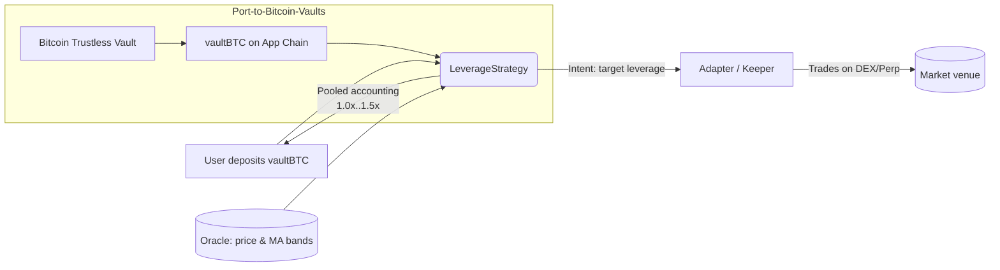

```mermaid
flowchart LR
  U[User deposits vaultBTC] --> S(LeverageStrategy)
  O[(Oracle: price & MA bands)] --> S
  S -->|Intent: target leverage| A[Adapter / Keeper]
  A -->|Trades on DEX/Perp| M[(Market venue)]
  S -->|Pooled accounting
1.0x..1.5x| U

  subgraph Port-to-Bitcoin-Vaults
    V[Bitcoin Trustless Vault] --> T[vaultBTC on App Chain]
    T --> S
  end
```
