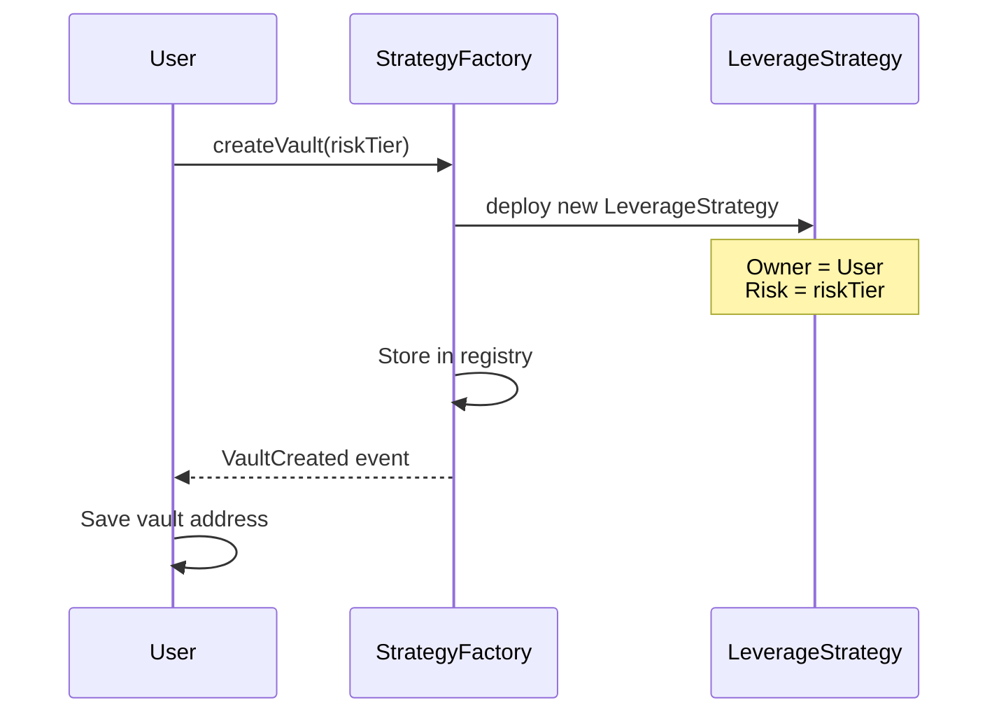
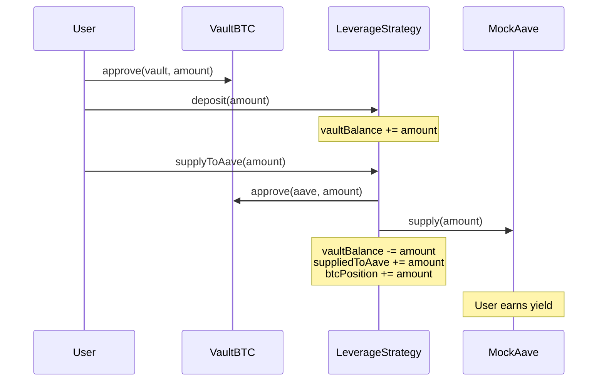
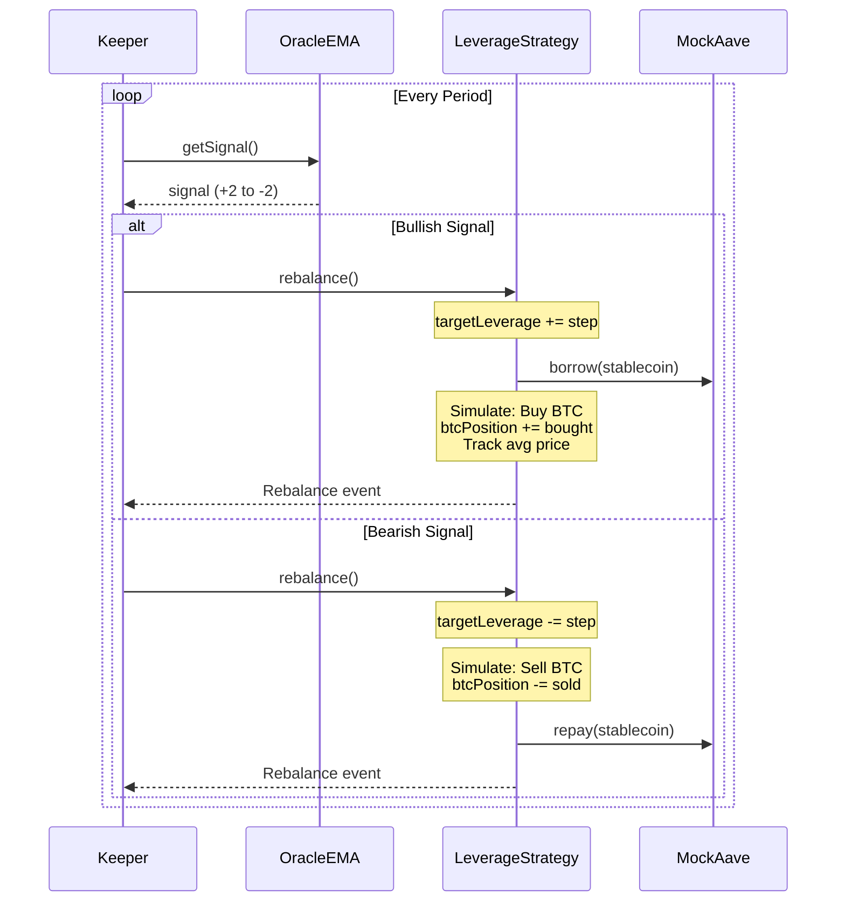
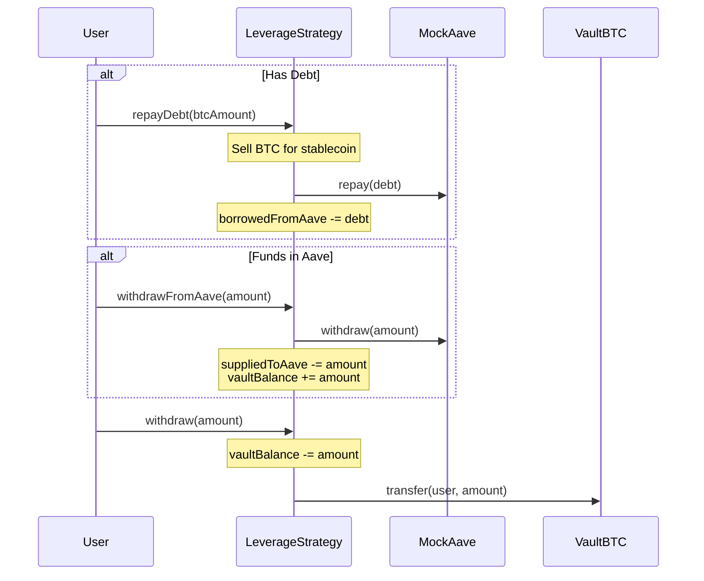

# 🚀 Vault Strategy

**Automated, EMA-based leverage management for Bitcoin holders with self-custody guarantees.**

A DeFi protocol that provides rule-based leverage management using 20/50/200-day EMA signals, allowing BTC holders to enhance returns while maintaining self-custody and reducing drawdown risk.

## 📋 Table of Contents

- [Problem Statement](#-problem-statement)
- [Solution](#-solution)
- [How It Works](#-how-it-works)
- [Quick Start](#-quick-start)
- [Architecture](#-architecture)
- [Contract Flow](#-contract-flow)

## 🎯 Problem Statement

Bitcoin holders face a dilemma:

- **Want**: Delta exposure with smoother drawdowns and automated profit-taking
- **Don't Want**: To give up self-custody or rely on centralized platforms
- **Current Solutions**: Manual leverage tools, centralized exchanges, or wrapped BTC with custody risk

**The Gap**: No automated, rule-based leverage system that works with self-custodied Bitcoin.

## 💡 Solution

Vault Strategy provides:

1. **Automated Leverage Management**: Uses EMA signals (20/50/200-day) to automatically adjust leverage
2. **Self-Custody Compatible**: Designed to work with Bitcoin trustless vaults (BitVM3)
3. **Risk-Tiered Approach**: Choose Low (1.1x), Medium (1.3x), or High (1.5x) max leverage
4. **Isolated Vaults**: Each user gets their own strategy contract via factory pattern
5. **Transparent Rules**: Open-source, auditable, EMA-based decision making

## 🔄 How It Works

### User Journey

```
1. Create Vault → 2. Deposit vBTC → 3. Supply to Aave → 4. Auto-Rebalance → 5. Withdraw
```

### Leverage Mechanism

**Bullish Signal** (Price > EMAs):
```
Supply BTC → Borrow Stablecoin → Buy More BTC → Increase Leverage
```

**Bearish Signal** (Price < EMAs):
```
Sell BTC → Repay Debt → Decrease Leverage → Protect Capital
```

### EMA Signal Detection

| Signal | Condition | Action |
|--------|-----------|--------|
| 📈 Strong Bullish (+2) | Price > all EMAs (20, 50, 200) | Increase leverage aggressively |
| 📈 Bullish (+1) | Price > EMA20 & EMA50 | Increase leverage moderately |
| ➡️ Neutral (0) | Mixed signals | Hold current leverage |
| 📉 Bearish (-1) | Price < EMA20 & EMA50 | Decrease leverage moderately |
| 📉 Strong Bearish (-2) | Price < all EMAs | Decrease leverage aggressively |

## 🚀 Quick Start

### Prerequisites
- Node.js 18+
- npm or yarn

### Setup Contracts

```bash
cd vault-contracts
npm install
npm run build
npm test              # Run 113 tests
npm run simulate      # Run full simulation
```

### Setup Frontend

```bash
cd frontend
npm create vite@latest . -- --template react-ts
npm install
npm install ethers @tanstack/react-query wagmi viem
npm run dev
```

## 🏛️ Architecture

### System Overview

```
┌─────────────┐
│   Users     │
└──────┬──────┘
       │ createVault()
       ▼
┌─────────────────────┐
│ StrategyFactory     │ ──────┐
│ - Creates vaults    │       │
│ - Tracks ownership  │       │
└─────────────────────┘       │
                              │ deploys
       ┌──────────────────────┘
       │
       ▼
┌─────────────────────────────────────┐
│ LeverageStrategy (Per-User Vault)   │
│ - Vault balance management          │
│ - Supply to Aave for yield          │
│ - Automated leverage adjustment     │
│ - Portfolio tracking                │
└──────┬──────────────┬───────────────┘
       │              │
       ▼              ▼
┌─────────────┐  ┌──────────────┐
│  MockAave   │  │  OracleEMA   │
│  - Supply   │  │  - Price     │
│  - Borrow   │  │  - EMA20/50  │
│  - Repay    │  │  - EMA200    │
└─────────────┘  │  - Signals   │
                 └──────────────┘
```

## 🔄 Contract Flow

### 1. Vault Creation Flow



### 2. Deposit & Supply Flow



### 3. Automated Rebalancing Flow



### 4. Withdrawal Flow



## 🤝 Contributing

Contributions are welcome! Please:

1. Fork the repository
2. Create a feature branch
3. Make your changes
4. Add tests
5. Submit a pull request

## 📄 License

MIT