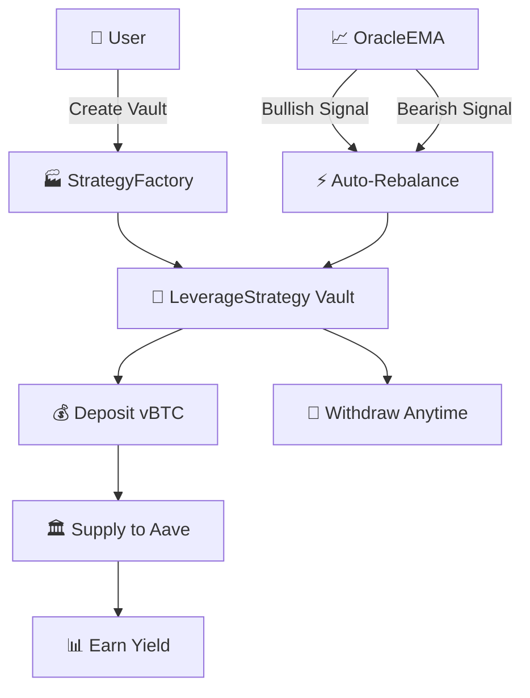

# 🚀 Vault Strategy

## 🌟 Project Vision

Vault Strategy transforms Bitcoin holding into an active, automated strategy. Our goal is to provide delta exposure with smoother drawdowns and automated profit-taking, while maintaining self-custody guarantees.

## 🎯 The Problem We Solve

**Bitcoin holders want better returns but face challenges:**

- ❌ Manual leverage management is time-consuming and emotional
- ❌ Centralized platforms require giving up custody
- ❌ Wrapped BTC solutions introduce counterparty risk
- ❌ No automated, rule-based leverage systems exist

**Vault Strategy makes it simple:**

- ✅ **Automated Leverage**: EMA signals (20/50/200-day) adjust leverage automatically
- ✅ **Self-Custody**: Designed for Bitcoin trustless vaults (BitVM3)
- ✅ **Risk Tiers**: Choose Low (1.1x), Medium (1.3x), or High (1.5x) max leverage
- ✅ **Isolated Vaults**: Each user owns their own strategy contract
- ✅ **Transparent Rules**: Open-source, auditable, EMA-based decisions

## 🏗️ System Design



### Key Components:

- **🏭 Factory Pattern**: Each user deploys their own isolated vault
- **📈 EMA Oracle**: 20/50/200-day EMAs for trend detection
- **🏛️ Aave Integration**: Supply BTC to earn yield, borrow for leverage
- **⚡ Auto-Rebalancing**: Increases leverage on bullish signals, decreases on bearish
- **💰 Manual Controls**: repayDebt() and withdrawFromAave() for user control

## ⚡ Quick Start

### 🚀 One-Command Setup

```bash
# Clone and install everything
git clone https://github.com/yourusername/vault-strategy.git
cd vault-strategy
npm run install:all
```

### 🏃‍♂️ Run the Application

```bash
# Start everything (frontend + contracts)
npm run dev
```

**That's it! 🎉**

- 🌐 Frontend: http://localhost:5173
- ⛓️ Local Blockchain: http://localhost:8545

## 🛠️ For Developers

<details>
<summary>📁 Project Structure</summary>

```
vault-strategy/
├── 📜 vault-contracts/    # Smart contracts & tests
│   ├── contracts/         # Solidity contracts
│   ├── scripts/           # Deployment scripts
│   ├── test/              # 119 passing tests
│   └── README.md
├── 📱 frontend/           # React + TypeScript UI
│   ├── src/               # Frontend source
│   ├── public/            # Static assets
│   └── README.md
└── 📚 README.md           # This file
```

</details>

<details>
<summary>🔧 Development Commands</summary>

```bash
# Contracts
cd vault-contracts
npm install
npm run build              # Compile contracts
npm test                   # Run 119 tests
npm run test:integration   # Full lifecycle test
npm run simulate           # End-to-end simulation

# Frontend
cd frontend
npm install
npm run dev                # Start dev server
npm run build              # Build for production
npm run lint               # Code quality checks

# Local Development
cd vault-contracts
npx hardhat node           # Terminal 1: Start local blockchain
npm run setup              # Terminal 2: Deploy contracts
cd ../frontend
npm run dev                # Terminal 3: Start frontend
```

</details>

<details>
<summary>⚙️ Environment Setup</summary>

Create `.env` files in each directory:

**Frontend (`frontend/.env`):**

```env
VITE_CHAIN_ID=31337
VITE_RPC_URL=http://localhost:8545
VITE_VAULT_BTC_ADDRESS=your_deployed_vbtc_address
VITE_STRATEGY_FACTORY_ADDRESS=your_deployed_factory_address
VITE_ORACLE_ADDRESS=your_deployed_oracle_address
VITE_AAVE_ADDRESS=your_deployed_aave_address
```

**Contracts (`vault-contracts/.env`):**

```env
# Deployment
PRIVATE_KEY=your_deployer_private_key
RPC_URL=https://eth-sepolia.g.alchemy.com/v2/your-api-key

# Contract Addresses (after deployment)
VAULT_BTC_ADDRESS=deployed_vbtc_address
STRATEGY_FACTORY_ADDRESS=deployed_factory_address
ORACLE_ADDRESS=deployed_oracle_address
AAVE_ADDRESS=deployed_aave_address
```

</details>

<details>
<summary>📊 Smart Contracts Overview</summary>

### Core Contracts

**StrategyFactory.sol**
- Creates isolated vaults for each user
- Tracks all deployed vaults
- Provides vault lookup by owner

**LeverageStrategy.sol** (Per-User Vault)
- Owner-only: deposit, withdraw, supplyToAave, repayDebt
- Public: rebalance (automated leverage adjustment)
- Tracks: vault balance, supplied collateral, debt, BTC position

**VaultBTC.sol**
- ERC20 token with 8 decimal precision
- Demo: Public mint/burn
- Production: Replace with Bitcoin bridge token

**MockAave.sol** (Demo)
- Simplified lending pool
- 75% LTV, 80% liquidation threshold
- Production: Replace with real Aave

**OracleEMA.sol** (Demo)
- Stores price + 20/50/200-day EMAs
- Signal detection: +2 (strong bullish) to -2 (strong bearish)
- Production: Replace with Chainlink

</details>

## 🏛️ Architecture

### How It Works

**1. Vault Creation**
```
User → StrategyFactory.createVault(riskTier) → New LeverageStrategy deployed
```

**2. Deposit & Supply**
```
User deposits vBTC → Vault balance → Supply to Aave → Earn yield
```

**3. Automated Rebalancing**
```
Bullish Signal: Borrow stablecoin → Buy BTC → Increase leverage
Bearish Signal: Sell BTC → Repay debt → Decrease leverage
```

**4. Withdrawal**
```
Repay debt (if any) → Withdraw from Aave → Withdraw to wallet
```

### EMA Signal Detection

| Signal | Condition | Leverage Action |
|--------|-----------|-----------------|
| 📈 Strong Bullish (+2) | Price > all EMAs | Increase aggressively |
| 📈 Bullish (+1) | Price > EMA20 & EMA50 | Increase moderately |
| ➡️ Neutral (0) | Mixed signals | Hold current |
| 📉 Bearish (-1) | Price < EMA20 & EMA50 | Decrease moderately |
| 📉 Strong Bearish (-2) | Price < all EMAs | Decrease aggressively |

### Risk Tiers

| Tier | Max Leverage | Step Size | Use Case |
|------|--------------|-----------|----------|
| 🛡️ Low | 1.1x | 0.05x | Conservative |
| ⚖️ Medium | 1.3x | 0.1x | Balanced |
| 🔥 High | 1.5x | 0.1x | Aggressive |


## 🌟 What Makes This Unique

1. **EMA-Based Auto-Leverage**: 20/50/200-day EMAs for trend detection
2. **Vault Balance Separation**: Deposits distinct from active collateral
3. **Portfolio Tracking**: Average BTC purchase price for PnL visibility
4. **Self-Custody Forward**: Designed for trustless vaultBTC
5. **Risk-Tiered**: 1.0–1.5x reduces liquidation risk
6. **Isolated Vaults**: Per-user contracts for maximum control
7. **Manual Override**: repayDebt() and withdrawFromAave() anytime

## 📄 License

This project is licensed under the MIT License - see the [LICENSE](LICENSE) file for details.