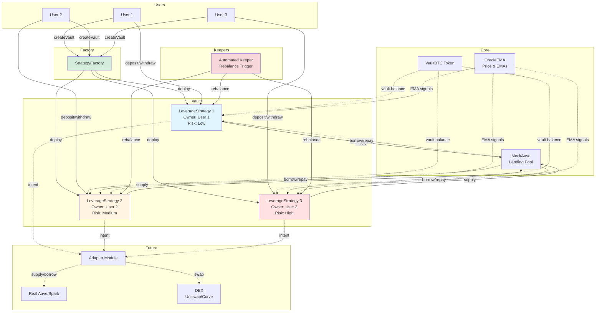
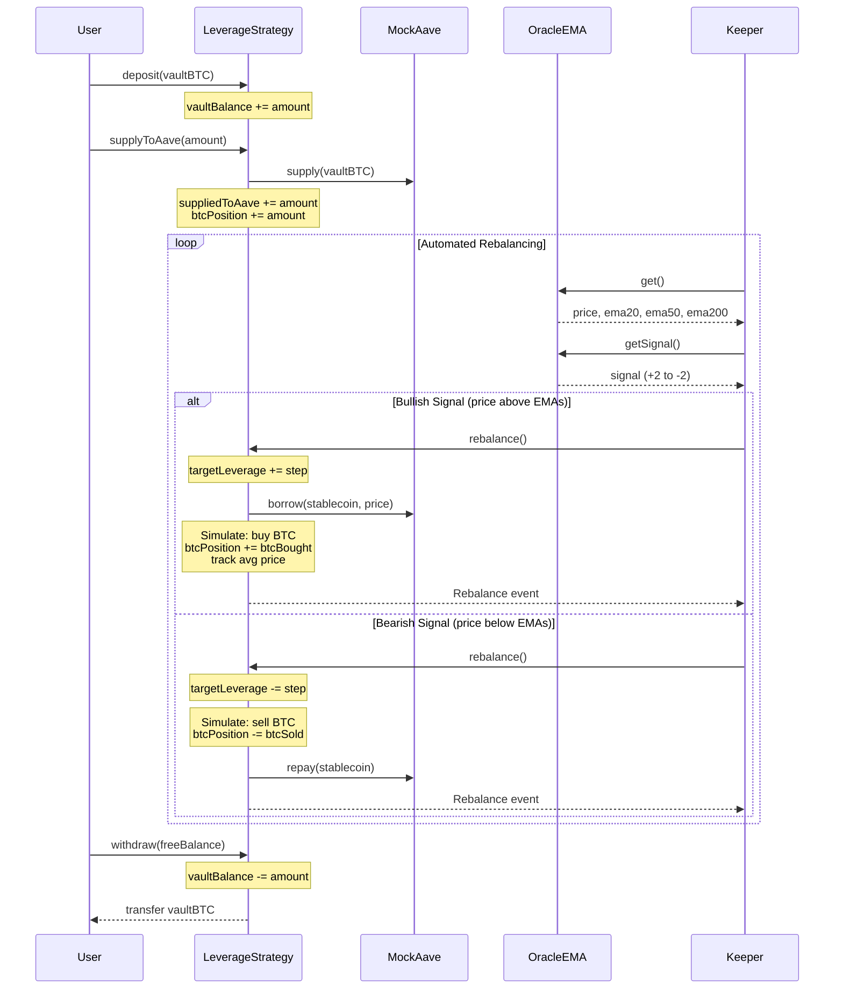
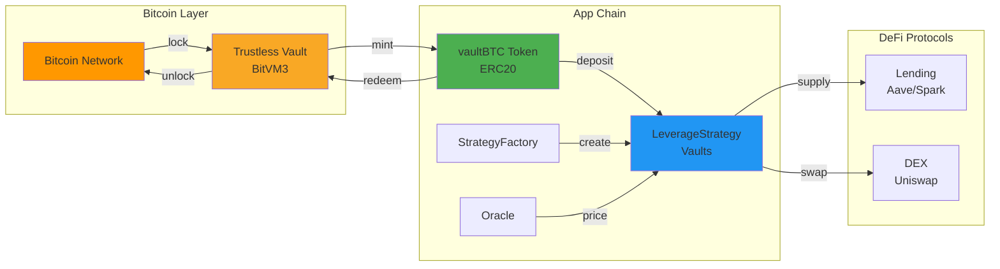

# Architecture & Design

## System Overview

The Vault Strategy uses a factory pattern where each user deploys their own isolated vault contract. The system automatically adjusts leverage based on EMA signals (20/50/200-day), while maintaining user custody of funds. User deposits stay as vault balance and are supplied to Aave for yield, with the system managing leverage through borrowing and simulated BTC purchases.

## Factory Pattern

Users create isolated vaults via `StrategyFactory.createVault(riskTier)`:
- Each user gets their own `LeverageStrategy` contract
- Factory maintains registry of all vaults
- Vault ownership is set to the creator (`msg.sender`)
- Factory tracks vaults by owner for easy discovery

## Contract Architecture

### StrategyFactory.sol
- Creates isolated LeverageStrategy vaults for each user
- Tracks all deployed vaults in registry
- Provides vault lookup by user address
- Emits `VaultCreated` events for indexing

### LeverageStrategy.sol
- Per-user isolated vault (created by factory)
- **Owner-only**: deposit, withdraw, setRisk, supplyToAave
- **System-callable**: rebalance (automated leverage/deleverage)
- **Risk tiers**: Low/Medium/High with different max leverage and step sizes
- **Rebalance logic**: adjusts `targetLeverageBps` based on EMA signals
- **Position tracking**: tracks vault balance, supplied collateral, debt, BTC position, average price

### VaultBTC.sol
- Minimal ERC20 implementation (8 decimal precision)
- Public `mint()` and `burn()` functions (demo only)
- In production: replace with real vault token from Bitcoin bridge

### MockAave.sol
- Simplified Aave-like lending pool (demo)
- Functions: supply, withdraw, borrow, repay
- 75% LTV (collateral factor), 80% liquidation threshold
- Tracks supplied collateral and borrowed debt per user
- In production: replace with real Aave/Spark integration

### OracleEMA.sol
- Owner-updatable EMA oracle (demo)
- Stores: spot price, 20-day EMA, 50-day EMA, 200-day EMA
- Provides signal detection: strong bullish (+2) to strong bearish (-2)
- All values use 8 decimal precision
- In production: replace with Chainlink + on-chain EMA calculation

## Access Control Model

### Owner-Only Functions
- `deposit()` - Add vaultBTC to vault balance
- `withdraw()` - Remove vaultBTC from free balance (not supplied to Aave)
- `setRisk()` - Change risk tier (Low/Medium/High)
- `supplyToAave()` - Supply vault balance to Aave as collateral

### Public/System Functions
- `rebalance()` - Adjust leverage based on EMA signals (callable by keepers/bots)

This separation allows:
- Users maintain full control over their funds
- Automated systems can optimize leverage without withdrawal risk
- Keepers can trigger rebalances for all vaults

## Rebalance Logic

### Core Algorithm

The strategy uses EMA signals to adjust target leverage:

```
signal = oracle.getSignal()  // -2 to +2 based on price vs EMAs

if (signal > 0):  // Bullish
    targetLeverage += stepSize  // up to maxLeverage for risk tier
    borrowAndBuy()  // Borrow stablecoin, buy BTC
    
if (signal < 0):  // Bearish
    targetLeverage -= stepSize  // down to 1.0x
    sellAndRepay()  // Sell BTC, repay debt
```

### EMA Signal Detection

- **Strong Bullish (+2)**: Price above all EMAs (20, 50, 200)
- **Bullish (+1)**: Price above 20 and 50 EMAs
- **Neutral (0)**: Mixed signals
- **Bearish (-1)**: Price below 20 and 50 EMAs
- **Strong Bearish (-2)**: Price below all EMAs

### Risk Tier Parameters

| Risk Tier | Max Leverage | Step Size | Use Case |
|-----------|--------------|-----------|----------|
| Low | 1.1x (11000 bps) | 0.05x (500 bps) | Conservative, minimal liquidation risk |
| Medium | 1.3x (13000 bps) | 0.1x (1000 bps) | Balanced risk/reward |
| High | 1.5x (15000 bps) | 0.1x (1000 bps) | Aggressive, higher returns but more risk |

### Execution Flow

**Demo (Current)**
1. `rebalance()` called by keeper/system
2. Oracle provides: price, ema20, ema50, ema200, signal
3. Strategy calculates new `targetLeverageBps` based on signal
4. **If bullish**: `_borrowAndBuy()` - borrows from Aave, simulates BTC purchase
5. **If bearish**: `_sellAndRepay()` - simulates BTC sale, repays Aave debt
6. Updates `btcPosition`, `borrowedFromAave`, tracks average BTC price
7. Emits `Rebalance` event with leverage and signal

**Production (Future)**
1. `rebalance()` called by keeper/system
2. Oracle provides: price, ema20, ema50, ema200, signal
3. Strategy calculates new `targetLeverageBps` based on signal
4. Adapter module executes the leverage change:
   - **Increase leverage**: Borrow stablecoin from Aave → Swap to BTC via DEX → Track position
   - **Decrease leverage**: Swap BTC to stablecoin via DEX → Repay Aave debt
5. Adapter reports fill data for PnL tracking
6. Emits `Rebalance` event with execution details

## Leverage Loop (Production)

### Increasing Leverage (Price Dips)
1. Supply existing vaultBTC to lending platform (Aave/Spark)
2. Borrow stablecoin (USDC/DAI) against collateral
3. Swap stablecoin → vaultBTC via DEX (Uniswap/Curve)
4. Repeat steps 1-3 until target leverage reached

### Decreasing Leverage (Price Rallies)
1. Withdraw some vaultBTC from lending platform
2. Swap vaultBTC → stablecoin via DEX
3. Repay borrowed stablecoin debt
4. Repeat until target leverage reached

### Demo Implementation
Current demo uses MockAave and simulated swaps:
- `vaultBalance` - user's total balance in vault
- `suppliedToAave` - amount supplied to MockAave as collateral
- `borrowedFromAave` - stablecoin debt from MockAave
- `btcPosition` - total BTC position (supplied + purchased)
- `totalBtcPurchased` - tracks BTC bought with leverage
- `totalUsdSpent` - tracks USD spent on purchases
- Simulated BTC purchases/sales (no real DEX calls)

## Intent-Based Architecture

The strategy only sets **intent** (target leverage). A separate adapter module (off-chain keeper or on-chain bot) executes on DEX/Lending venues and reports fills.

This separation allows:
- Strategy logic remains simple and auditable
- Adapters can be upgraded without touching core strategy
- Multiple execution venues can be supported
- Slippage protection and execution optimization at adapter level

### Extending to Real Protocols

Add `IAdapter.executeTargetLeverage(targetBps)`:
- Adapter computes required delta (buy/sell amounts)
- Enforces slippage bounds and rate limits
- Submits trades to lending platform and DEX
- Stores fill data for PnL accounting
- Returns execution summary to strategy

## Integration Points (Production)

### Lending Platform
- Interface: `ILendingPool` (Aave/Spark compatible)
- Functions: `supply()`, `borrow()`, `repay()`, `withdraw()`
- Health factor monitoring required

### DEX Router
- Interface: `IDEXRouter` (Uniswap V2/V3 compatible)
- Functions: `swapExactTokensForTokens()`
- Slippage protection required

### Oracle
- Current: `OracleEMA` (demo, owner-updatable with 20/50/200-day EMAs)
- Production: Chainlink price feeds + on-chain EMA calculation or off-chain with verification
- Must include circuit breakers for price manipulation
- EMA updates should be rate-limited and validated

## Safety Considerations

### Before Rebalancing
- Verify oracle data is fresh (timestamp check)
- Ensure price deviation is within acceptable bounds
- Check health factor will remain above threshold
- Validate gas costs don't exceed expected range
- Confirm keeper has proper authorization

### Production Requirements
- Health factor must stay above liquidation threshold (e.g., > 1.5)
- Slippage bounds on all DEX swaps
- Rate limiting on rebalance frequency
- Emergency pause functionality
- Keeper bond/incentive mechanism

## Architecture Diagrams

### System Flow



### Leverage Loop Sequence



### Bitcoin Trustless Vault Integration



## Project Structure

### Directory Layout

```
├── contracts/
│   ├── VaultBTC.sol                # ERC20 token (demo)
│   ├── MockAave.sol                # Lending pool (demo)
│   ├── OracleEMA.sol               # EMA oracle (demo)
│   ├── LeverageStrategy.sol        # Per-user vault
│   └── StrategyFactory.sol         # Factory for vaults
├── scripts/
│   └── deploy.ts                   # Deployment script
├── test/
│   └── VaultStrategy.t.ts          # Integration tests
├── typechain-types/                # Generated types
├── hardhat.config.ts               # Hardhat config
├── tsconfig.json                   # TypeScript config
└── package.json                    # Dependencies
```

### Key Patterns

- **Factory Pattern**: Users create vaults via factory
- **Access Control**: Owner-only withdrawals, public rebalancing
- **Leverage Loop**: Supply → Borrow → Swap → Repeat
- **Immutability**: Core addresses set in constructor
- **Event-Driven**: All state changes emit events

### Testing Strategy

- Integration tests in TypeScript
- Tests cover: vault creation, isolated vaults, rebalancing, access control
- Use `beforeEach` for setup
- Helper functions for decimal conversions
- Verify leverage changes match expected behavior

### Deployment

- Deploy order: VaultBTC → MockAave → OracleEMA → StrategyFactory
- Factory constructor requires: vaultBTC address, aave address, oracle address
- Users call `factory.createVault(riskTier)` to deploy vault
- Risk tiers: 0=Low, 1=Medium, 2=High
- After vault creation: deposit vBTC, then call `supplyToAave()` to start earning yield
